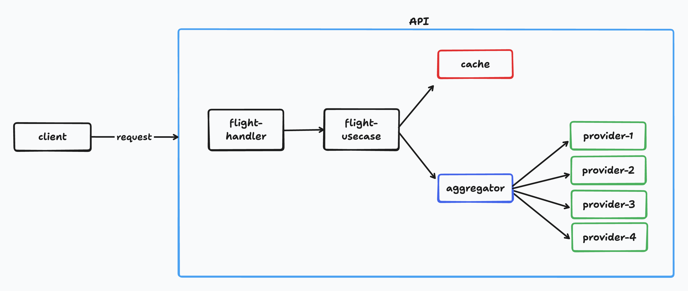

# Design & Architecture

## Design Approach

### Flight Handler

Flight Handler responsible to:

- Parse and validate the incoming `SearchRequest`.
- Wrap the request context with a timeout before passing it to Flight Usecase.
- Return the `SearchResponse` as JSON or a structured error on validation failure.

### Flight Usecase

Flight Usecase is the orchestrator between the HTTP layer and the data layer (provider). Its responsibilities are:

- Generate a cache key from the core search identity fields and check Redis.
- On a **cache hit**: deserialize the stored flights, apply filters and sort, return immediately with `cache_hit: true`.
- On a **cache miss**: delegate to the Aggregator, apply filters and sort to the result, write the raw unfiltered flights to cache, then return.
- For round-trip searches: run two Aggregator calls concurrently (outbound and inbound) and merge their metadata.

### Aggregator

Aggregator responsible to:

- Launch one goroutine per provider, all running concurrently.
- Collect results through a buffered channel. The buffer prevents goroutine leaks if the receiver exits early.
- Merge all successful flights into a single slice.
- Track which providers succeeded and which failed or timed out. Report this in `SearchMetadata`.
- Never fail the entire request because one provider failed. A valid response is always returned.

### Providers

Each provider is a self-contained package with two files:

- **`client.go`** which simulates the provider API call with a realistic delay. Specifically for AirAsia provider, it simulates a 10% random failure rate.
- **`normalizer.go`** which converts the provider's raw response format into the shared `model.Flight` struct. All provider-specific differences, e.g. time formats, duration units, stop representations, baggage structures, are resolved here and never leak into the layers above.

### Cache

Cache, implemented using Redis, is a simple key/value store used to avoid redundant provider calls. The cache stores the full unfiltered result set per unique route. Filters and sorting are always applied in-memory after retrieval, so every filter combination for the same route shares one cache entry.
Cache key format: `flights:{ORIGIN}:{DESTINATION}:{date}:{passengers}:{cabin}`
